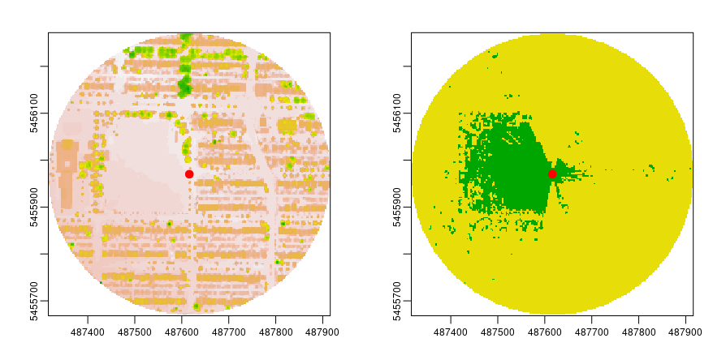

```{r, include = FALSE}
knitr::opts_chunk$set(
  collapse = TRUE,
  comment = "#>",
  fig.path = "man/figures/README-",
  out.width = "100%"
)
```

`GVI` is a R package to calculate a Green Visibility Index (GVI) surface from a DSM, DTM and Greenness Surface as demonstrated in [Labib, Huck and Lindley (2021)](https://doi.org/10.1016/j.scitotenv.2020.143050). `GVI` is written in C++ to provide fast and light weighted functionality.

# Installation

`GVI` is still in very active development. Therefore, the package is also not on CRAN yet. You can install the latest version of `GVI` from GitHub with:

``` r
remotes::install_git("https://github.com/STBrinkmann/GVI")
```

# Methods

## Viewshed

The `Viewshed` function computes the viewshed of a point on a Digital Surface Model map. A buffer is applied on the point and for every point on the perimeter a Line of Sight (LoS) is being calculated. Visibility along every point on the LoS is computed using a C++ implementation of Bresenham's line algorithm [[Bresenham 1965](https://doi.org/10.1147/sj.41.0025), [Bresenham 1977](https://doi.org/10.1145/359423.359432)] and simple geometry.



*Left: Digital Surface Model (DSM); Right: Viewshed, where green = visible and yellow = no-visible area.*

## Viewshed Greenness Visibility Index (VGVI)

The VGVI expresses the proportion of visible greenness to the total visible area based on a viewshed. The estimated VGVI values range between 0 and 1, where 0 = no green cells are visible, and 1 = all of the visible cells are green.

A decay function is applied, to account for the reducing visual prominence of an object in space with increasing distance from the observer. Currently two options are supported, a logistic and an exponential function. The `visualizeWeights` function helps setting the parameters *m* and *b*.


# About

## Package contributors

Brinkmann, Sebastian (Package creator and author) e-mail: [sebastian.brinkmann\@fau.de](mailto:sebastian.brinkmann@fau.de)

## Thesis authors

-   add authors of the paper

# Bibliography

Bresenham, J.E. (1965): Algorithm for computer control of a digital plotter. IBM Systems Journal, vol. 4, no. 1, pp. 25-30, doi: [10.1147/sj.41.0025](https://doi.org/10.1147/sj.41.0025).

Bresenham, Jack (1977): A linear algorithm for incremental digital display of circular arcs. Commun. ACM 20, 2 (Feb. 1977), 100–106. doi: [10.1145/359423.359432](https://doi.org/10.1145/359423.359432).

Labib, S.M., Jonny J. Huck, and Sarah Lindley (2021): Modelling and Mapping Eye-Level Greenness Visibility Exposure Using Multi-Source Data at High Spatial Resolutions. *Science of The Total Environment* 755 (February): 143050. doi: [j.scitotenv.2020.143050](https://doi.org/10.1016/j.scitotenv.2020.143050).

# ToDO

-   ~~Package dependencies~~

-   ~~Implement function to calculate weighed GVI~~

-   Code examples
