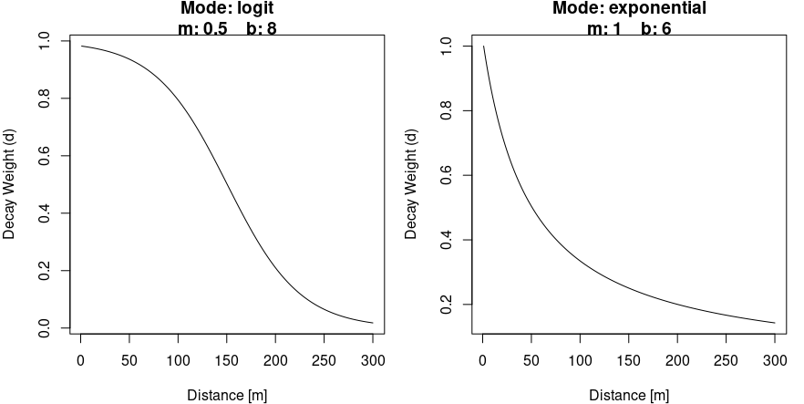
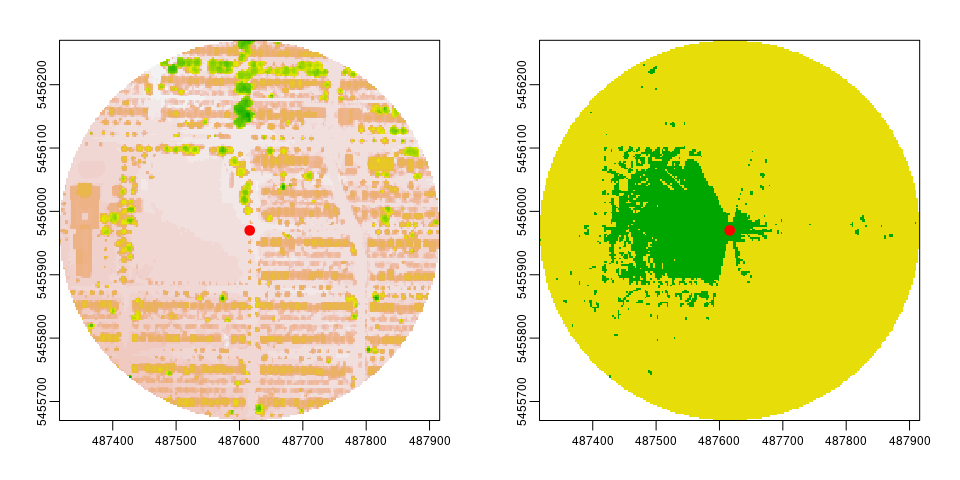

GVI — Work in Progress
================

-   [Installation](#installation)
-   [Methods](#methods)
    -   [Viewshed](#viewshed)
    -   [Viewshed Greenness Visibility Index
        (VGVI)](#viewshed-greenness-visibility-index-vgvi)
-   [Examples](#examples)
-   [About](#about)
    -   [Package contributors](#package-contributors)
    -   [Thesis authors](#thesis-authors)
-   [Bibliography](#bibliography)
-   [ToDO](#todo)

`GVI` is a R package to calculate a Green Visibility Index (GVI) surface
from a DSM, DTM and Greenness Surface as demonstrated by [Labib, Huck
and Lindley (2021)](https://doi.org/10.1016/j.scitotenv.2020.143050).
`GVI` is written in C++ to provide fast and light weighted
functionality.

# Installation

`GVI` is still in very active development. Therefore, the package is
also not on CRAN yet. You can install the latest version of `GVI` from
GitHub with:

``` r
remotes::install_git("https://github.com/STBrinkmann/GVI")
```

If the `remotes` has not been installed yet, install the released
version of remotes from CRAN:

``` r
install.packages("remotes")
```

# Methods

## Viewshed

The `Viewshed` function computes the viewshed of a point on a Digital
Surface Model map. A buffer is applied on the observer position, and for
every point on the perimeter a Line of Sight (LoS) is being calculated.
Visibility along every point on the LoS is computed using a C++
implementation of Bresenham’s line algorithm \[[Bresenham
1965](https://doi.org/10.1147/sj.41.0025), [Bresenham
1977](https://doi.org/10.1145/359423.359432)\] and simple geometry.

## Viewshed Greenness Visibility Index (VGVI)

The VGVI expresses the proportion of visible greenness to the total
visible area based on a viewshed. The estimated VGVI values range
between 0 and 1, where 0 = no green cells are visible, and 1 = all of
the visible cells are green.

A decay function is applied, to account for the reducing visual
prominence of an object in space with increasing distance from the
observer. Currently two options are supported, a logistic and an
exponential function.

 =
    \cfrac{1}{1 + e^{ \,b \,(x-m)}}
    && \text{(logistic)}\\
  f(x) =
    \cfrac{1}{1 + (bx^{\,m})}
    && \text{(exponential)}
\end{align*}
")

The `visualizeWeights()` function helps setting the parameters *m* and
*b*.



*Example output of the* `visualizeWeight` *function to compare and*
parameterize *the decay weights of a logistic (left) and an exponential
(right) function.*

# Examples

For the example we will use [Digital Elevation Model
(DEM)](https://opendata.vancouver.ca/explore/dataset/digital-elevation-model),
a binary Greenspace Mask based on a [land cover
classification](http://www.metrovancouver.org/data) and Digital Surface
Model (DSM). The DSM is generated from [LiDAR data collected in
2013](https://opendata.vancouver.ca/explore/dataset/lidar-2013/) and a
detailed explanation on how the DSM has been generated using R is
provided in
[this](https://geobrinkmann.com/post/visible-greenness-exposure/)
tutorial. To reduce the size of the R package, the data has been
uploaded to GoogleDrive and needs to be downloaded first.

``` r
# Download DEM
DEM_tmp <- tempfile(fileext = ".tif")
download.file(url = "https://github.com/STBrinkmann/data/raw/main/Vancouver_DEM.tif",
              destfile = DEM_tmp)

# Download DSM
DSM_tmp <- tempfile(fileext = ".tif")
download.file(url = "https://github.com/STBrinkmann/data/raw/main/Vancouver_DSM.tif",
              destfile = DSM_tmp)

# Download GreenSpace
GS_tmp <- tempfile(fileext = ".tif")
download.file(url = "https://github.com/STBrinkmann/data/raw/main/Vancouver_GreenSpace.tif",
              destfile = GS_tmp)
```

Load DSM, DEM and Greenspace Mask, and generate the observer location as
an `sf_point` feature.

``` r
library(terra)
library(sf)
library(sfheaders)

DEM <- rast(DEM_tmp)
DSM <- rast(DSM_tmp)
GreenSpace <- rast(GS_tmp)

observer <- st_sf(sf_point(c(487616.2, 5455970)), crs = st_crs(26910))
```

Calculate the viewshed for a 300 meters radius around the observers
position at 1.7 meters height.

``` r
library(GVI)
viewshed1 <- viewshed(sf_start = observer, dsm_data = DSM, dtm_data = DEM,
                      max_distance = 300, observer_height = 1.7, plot = TRUE)
```



*Left: Digital Surface Model (DSM); Right: Viewshed, where green =
visible and yellow = no-visible area.*

The Viewshed Greenness Visibility Index (VGVI) can now be calculated
using the `vgvi` function.

``` r
vgvi(viewshed = viewshed1, sf_start = observer, greenspace = GreenSpace, m = 0.5, b = 8)
```

The output of 0.86 indicates, that \~86% of the visible area, within a
300 meters radius, is green.

# About

## Package contributors

Brinkmann, Sebastian (Creator and author) e-mail:
<sebastian.brinkmann@fau.de>

S.M. Labib (Author) e-mail: <sml80@medschl.cam.ac.uk>

## Thesis authors

S.M. Labib (1, 2\*)  
Jonny J. Huck (1)  
Sarah Lindley (1)

1: Department of Geography, School of Environment, Education and
Development (SEED), University of Manchester, Arthur Lewis building (1st
Floor), Oxford Road, Manchester M13 9PL, United Kingdom.

2: Centre for Diet and Activity Research (CEDAR), MRC Epidemiology Unit,
University of Cambridge, Clifford Allbutt Building, CB2 0AH, Cambridge,
United Kingdom.

\*corresponding author

# Bibliography

Bresenham, J.E. (1965): Algorithm for computer control of a digital
plotter. IBM Systems Journal, vol. 4, no. 1, pp. 25-30, doi:
[10.1147/sj.41.0025](https://doi.org/10.1147/sj.41.0025).

Bresenham, Jack (1977): A linear algorithm for incremental digital
display of circular arcs. Commun. ACM 20, 2 (Feb. 1977), 100–106. doi:
[10.1145/359423.359432](https://doi.org/10.1145/359423.359432).

Labib, S.M., Jonny J. Huck, and Sarah Lindley (2021): Modelling and
Mapping Eye-Level Greenness Visibility Exposure Using Multi-Source Data
at High Spatial Resolutions. *Science of The Total Environment* 755
(February): 143050. doi:
[j.scitotenv.2020.143050](https://doi.org/10.1016/j.scitotenv.2020.143050).

# ToDO

-   ~~Thesis author section~~

-   ~~library(devtools)~~

-   ~~Sample data~~

-   Rework decay function

-   Input check for all functions

-   VGVI for multiple points, lines and polygons
