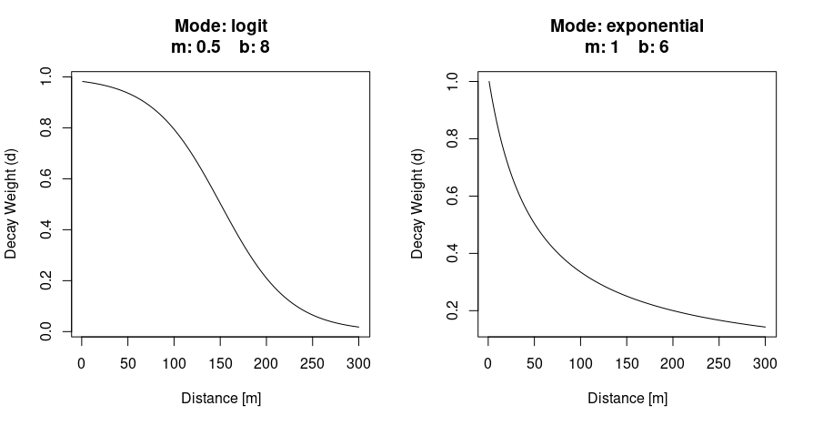
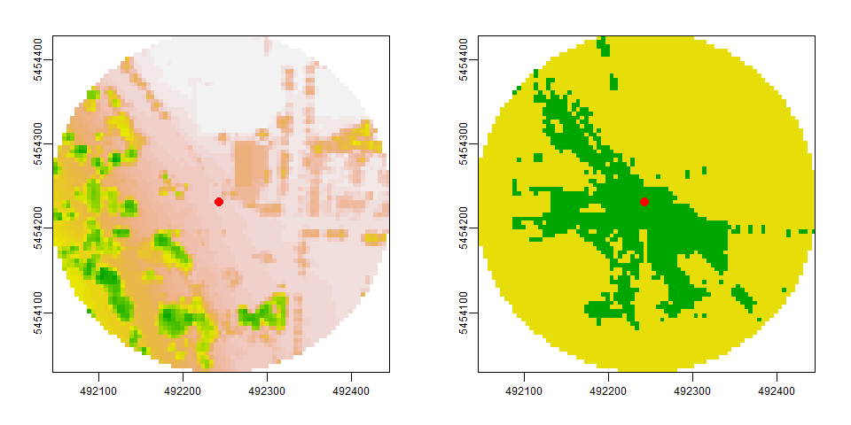
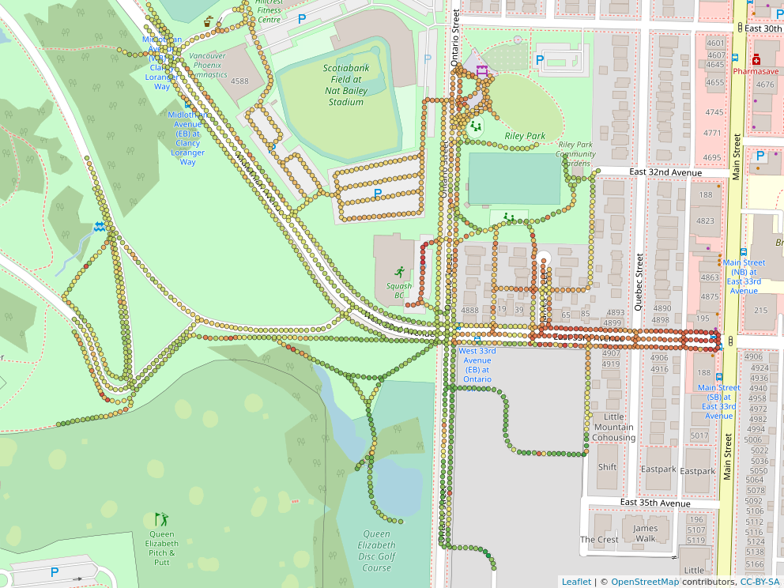

GVI — Work in Progress
================

The `GVI` R package helps researchers compute the Green Visibility Index
(GVI) presented by [Labib, Huck and Lindley
(2021)](https://doi.org/10.1016/j.scitotenv.2020.143050). The GVI is
calculated using a Digital Surface Model (DSM), Digital Terrain Model
(DTM) and Greenness Raster. `GVI` is written in C++ to provide fast and
light weighted functionality.

-   [Functions](https://github.com/STBrinkmann/GVI#functions)

-   [Installation](https://github.com/STBrinkmann/GVI#installation)

-   [Methods](https://github.com/STBrinkmann/GVI#methods)

-   [Examples](https://github.com/STBrinkmann/GVI#examples)

# Functions

| Function                                                                                                | Description                                                                                       |
|---------------------------------------------------------------------------------------------------------|---------------------------------------------------------------------------------------------------|
| [*viewshed*](https://github.com/STBrinkmann/GVI#viewshed)                                               | Computes the viewshed of a single point on a Digital Surface Model                                |
| [*vgvi*](https://github.com/STBrinkmann/GVI#viewshed-greenness-visibility-index-vgvi)                   | Computes the Viewshed Greenness Visibility Index (VGVI) based on a viewshed                       |
| [*visualizeWeights*](https://github.com/STBrinkmann/GVI#visualize-weights)                              | Helper function, to adjust spatial weight parameters in the *vgvi* and *vgvi\_from\_sf* functions |
| [*vgvi\_from\_sf*](https://github.com/STBrinkmann/GVI#viewshed-greenness-visibility-index-vgvi-from-sf) | Combines the *viewshed* and *vgvi* functions; Supports multiple points, lines or polygons         |

# Installation

1.  Install [R](https://cran.r-project.org/)

    -   (Recommended) Install
        [RStudio](https://www.rstudio.com/products/rstudio/download/)

2.  Install [terra](https://github.com/rspatial/terra)

3.  Install GVI:

    -   Install remotes

        `install.packages("remotes")`

    -   Install `GVI`

        `GVI` is still in very active development. Therefore, the
        package is also not on CRAN yet. You can install the latest
        version of `GVI` from GitHub with:  
        `remotes::install_git("https://github.com/STBrinkmann/GVI")`

# Methods

## Viewshed

The `viewshed` function computes the viewshed of a single point on a
Digital Surface Model raster. A buffer is applied on the observer
position, and for every point on the perimeter a Line of Sight (LoS) is
being calculated. Visibility along every point on the LoS is computed
using a C++ implementation of Bresenham’s line algorithm \[[Bresenham
1965](https://doi.org/10.1147/sj.41.0025), [Bresenham
1977](https://doi.org/10.1145/359423.359432)\] and simple geometry. The
result of the `viewshed` function is a radial raster where 0 =
no-visible and 1 = visible area.

## Viewshed Greenness Visibility Index (VGVI)

The VGVI expresses the proportion of visible greenness to the total
visible area based on a viewshed. The estimated VGVI values range
between 0 and 1, where 0 = no green cells are visible, and 1 = all of
the visible cells are green.

Based on a viewshed and a binary greenspace raster, all visible points
are classified as visible and not-visible. All values are summarized
using a decay function, to account for the reducing visual prominence of
an object in space with increasing distance from the observer. Currently
two options are supported, a logistic and an exponential function.

 = \cfrac{1}{1 + e^{b(x-m)}} && \text{(logistic)}\\ f(x) = \cfrac{1}{1 + (bx^{m})} && \text{(exponential)} \end{align*} ")

## Visualize Weights

The `visualizeWeights` function helps to adjust spatial weight
parameters *m* and *b* used in the `vgvi` and `vgvi_from_sf` functions.



*Example output of the* `visualizeWeight` *function to compare and
parameterize the decay weights of a logistic (left) and an exponential
(right) function.*

## Viewshed Greenness Visibility Index (VGVI) from sf

The `vgvi_from_sf` function combines the `viewshed` and `vgvi`
functions. The input of the observer location is an
[sf](https://r-spatial.github.io/sf/) object (supports points, lines and
polygons). If this object is a line or polygon feature, it will be
converted to points. For every point, first the viewshed, than the VGVI
is being calculated. The output of the `vgvi_from_sf` function is a
single sf point object containing the VGVI for every point. This
function supports parallel computation on Windows, Linux and MacOS,
however it is highly recommended to use Linux or MacOS.

# Examples

For the examples we will use a [Digital Elevation Model
(DEM)](https://opendata.vancouver.ca/explore/dataset/digital-elevation-model),
a binary Greenspace Mask based on a [land cover
classification](http://www.metrovancouver.org/data) and a Digital
Surface Model (DSM). The DSM is generated from [LiDAR data collected in
2013](https://opendata.vancouver.ca/explore/dataset/lidar-2013/). A
detailed explanation on how the DSM has been generated using R is
provided in
[this](https://geobrinkmann.com/post/visible-greenness-exposure/)
tutorial. To reduce the size of the R package, the sample data has been
uploaded to a separate GitHub repository and needs to be downloaded
first.

``` r
# Download DEM
DEM_tmp <- tempfile(fileext = ".tif")
download.file(url = "https://github.com/STBrinkmann/data/raw/main/GVI_Data/GVI_DEM.tif",
              destfile = DEM_tmp, mode="wb")

# Download DSM
DSM_tmp <- tempfile(fileext = ".tif")
download.file(url = "https://github.com/STBrinkmann/data/raw/main/GVI_Data/GVI_DSM.tif",
              destfile = DSM_tmp, mode="wb")

# Download GreenSpace
GS_tmp <- tempfile(fileext = ".tif")
download.file(url = "https://github.com/STBrinkmann/data/raw/main/GVI_Data/GVI_GreenSpace.tif",
              destfile = GS_tmp, mode="wb")
```

Load DSM, DEM and Greenspace Mask, and generate the observer location as
a `sf` `POINT` feature.

``` r
# Load libraries. if one is not installed, use the "install.packages()" function
library(terra)
library(sf)
library(sfheaders)

# Load raster objects
DEM <- rast(DEM_tmp)
DSM <- rast(DSM_tmp)
GreenSpace <- rast(GS_tmp)

# Generate single observer point
observer <- st_sf(sf_point(c(492243.3, 5454231.4)), crs = st_crs(26910))
```

Calculate the viewshed for a 200 meters radius around the observers
position at 1.7 meters height (eye level).

``` r
library(GVI)
viewshed1 <- viewshed(sf_start = observer, dsm_data = DSM, dtm_data = DEM,
                      max_distance = 200, observer_height = 1.7, plot = TRUE)
```



*Left: Digital Surface Model (DSM); Right: Viewshed, where green =
visible and yellow = no-visible area.*

The Viewshed Greenness Visibility Index (VGVI) can now be calculated
using the `vgvi` function.

``` r
vgvi(viewshed = viewshed1, greenspace = GreenSpace, m = 0.5, b = 8)
```

The output of 0.58 indicates, that \~58% of the visible area, within a
200 meters radius, is green.

We also provide sample data of a sf line feature to demonstrate the
`vgvi_from_sf` function. This feature represents roads and paths, that
can be reached by walking within 5 minutes from our observer location.

``` r
# Download line feature and load as sf object
isodistance <- read_sf("https://github.com/STBrinkmann/data/raw/main/GVI_Data/isoline.gpkg")
```

Compute the VGVI along the line feature. Since the resolution is 5
meters, points along the line feature will be generated every 5 meters.

``` r
vgvi_sf <- vgvi_from_sf(sf_start = isodistance,
                        dsm_data = DSM, dtm_data = DEM, greenspace = GreenSpace, 
                        max_distance = 200, observer_height = 1.7,
                        m = 1, b = 3, mode = "exponential", cores = 20, progress = FALSE)
```

 *Output of the* `vgvi_from_sf` *function. Red
points indicate low, green points indicate high values of VGVI. Paths
and roads along the park tend to have high visible greenness, the road
in the east has low visible greenness.*

# About

## Package contributors

Brinkmann, Sebastian (Creator and author) e-mail:
<sebastian.brinkmann@fau.de>

S.M. Labib (Author) e-mail: <sml80@medschl.cam.ac.uk>

## Thesis authors

S.M. Labib (1, 2\*)  
Jonny J. Huck (1)  
Sarah Lindley (1)

1: Department of Geography, School of Environment, Education and
Development (SEED), University of Manchester, Arthur Lewis building (1st
Floor), Oxford Road, Manchester M13 9PL, United Kingdom.

2: Centre for Diet and Activity Research (CEDAR), MRC Epidemiology Unit,
University of Cambridge, Clifford Allbutt Building, CB2 0AH, Cambridge,
United Kingdom.

\*corresponding author

# Bibliography

Bresenham, J.E. (1965): Algorithm for computer control of a digital
plotter. IBM Systems Journal, vol. 4, no. 1, pp. 25-30, doi:
[10.1147/sj.41.0025](https://doi.org/10.1147/sj.41.0025).

Bresenham, Jack (1977): A linear algorithm for incremental digital
display of circular arcs. Commun. ACM 20, 2 (Feb. 1977), 100–106. doi:
[10.1145/359423.359432](https://doi.org/10.1145/359423.359432).

Labib, S.M., Jonny J. Huck, and Sarah Lindley (2021): Modelling and
Mapping Eye-Level Greenness Visibility Exposure Using Multi-Source Data
at High Spatial Resolutions. *Science of The Total Environment* 755
(February): 143050. doi:
[j.scitotenv.2020.143050](https://doi.org/10.1016/j.scitotenv.2020.143050).

# ToDO

-   ~~Thesis author section~~

-   ~~library(devtools)~~

-   ~~Sample data~~

-   Decay function

-   ~~Input check for all functions~~

-   ~~VGVI for multiple points, lines and polygons~~
